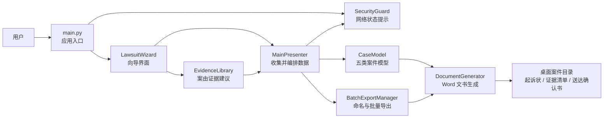

# 民事立案文书助手（离线版）

离线填写案情，一次生成民事起诉状、证据清单与送达地址确认书。

民事立案文书助手是一款基于 Python 与 PySide6 的桌面向导工具，面向需要整理常见民事立案材料的个人与基层法律服务场景。应用在本机收集当事人和案情信息，按案由生成结构化诉讼请求、事实与理由以及配套 Word 文书，不依赖在线服务，也不会主动上传案件数据。

> **重要说明：** 本项目用于辅助整理文书，不构成法律意见，也不能替代律师、仲裁机构或人民法院的专业判断。正式提交前，请核对事实、金额、证据、管辖法院、程序前置条件及当地最新要求。

## 目录

- [核心能力](#核心能力)
- [支持的案件类型](#支持的案件类型)
- [工作流程](#工作流程)
- [架构](#架构)
- [技术栈](#技术栈)
- [快速开始](#快速开始)
- [构建与验证](#构建与验证)
- [输出与隐私](#输出与隐私)
- [项目结构](#项目结构)
- [当前边界](#当前边界)

## 核心能力

- **向导式信息采集：** 按案件类型依次填写当事人、事实、金额、证据和管辖法院等信息。
- **多案由文书生成：** 通过独立案件模型生成诉讼请求与事实理由，而不是只替换一份固定模板。
- **配套材料批量导出：** 一次生成民事起诉状、证据清单和送达地址确认书三份 `.docx` 文件。
- **常见证据建议：** 针对不同案由预置证据名称和证明目的，支持在界面中修改、增加或删除。
- **辅助计算与提示：** 支持借款利息暂计、物业费计算、欠薪金额计算，以及劳动争议仲裁前置提示。
- **本地隐私设计：** 启动时检查默认网络路由并提示离线使用，生成完成后对案件模型中的敏感字段执行尽力清理。

## 支持的案件类型

| 案件类型 | 结构化内容 | 已实现的辅助能力 |
| --- | --- | --- |
| 民间借贷纠纷 | 借款时间、用途、本金、交付方式、利率、催收情况 | 利息暂计、借条状态、证据建议 |
| 买卖合同纠纷 | 合同、标的、交付签收、欠款、违约金 | 逾期付款表述、交付状态、证据建议 |
| 物业服务合同纠纷 | 房屋、面积、单价、欠费期间、催缴记录 | 欠费月份与金额计算、金额偏差提示 |
| 劳动报酬／工资追索 | 入离职、岗位、工资、欠薪期间、加班、合同与社保 | 欠薪计算、未签合同请求、仲裁前置提示 |
| 离婚、析产与抚养费纠纷 | 婚姻、子女、抚养诉求、财产与离婚原因 | 抚养及财产诉求组织、证据建议 |

## 工作流程

1. 应用启动并检查当前设备是否存在默认网络路由；联网时提示用户切换到离线环境。
2. 用户选择案由，填写原被告、案件事实、金额和管辖法院。
3. 系统按案由载入常见证据，用户可根据实际材料调整清单。
4. 案件模型生成诉讼请求和事实理由，文档生成器套用 Word 排版。
5. 系统在桌面创建案件文件夹，输出三份立案材料，并对内存模型中的敏感字段执行尽力清理。



## 架构

项目采用轻量的 Model–View–Presenter 组织方式：

| 层次 | 位置 | 职责 |
| --- | --- | --- |
| 入口 | [`main.py`](main.py) | 创建 Qt 应用、执行网络状态提示、组装界面与 Presenter |
| View | [`views/`](views) | 向导页面、字段校验、案由分支和预览界面 |
| Presenter | [`presenters/main_presenter.py`](presenters/main_presenter.py) | 将界面字段转换为案件模型并触发批量导出 |
| Model | [`models/case_model.py`](models/case_model.py) | 当事人、证据和五类案件的请求／事实生成逻辑 |
| 文书与规则工具 | [`utils/`](utils) | Word 排版、证据建议、批量命名、程序提示与隐私清理 |

应用当前没有数据库、服务端接口或云端依赖。案件数据只在当前进程和生成的本地 Word 文件中流转。

## 技术栈

| 组件 | 用途 | 项目约束 |
| --- | --- | --- |
| Python | 应用运行时 | 项目尚未固定 Python 次版本；当前仓库已用 Python 3.12.10 完成语法检查 |
| PySide6 | Qt 桌面界面 | `>=6.5.0` |
| python-docx | Word 文书生成 | `>=0.8.11` |
| PyInstaller | Windows 可执行程序打包 | `>=6.0.0` |

当前主要面向 Windows 桌面环境。源码包含其他桌面系统的网络路由检测分支，但仓库只提供了 Windows 构建脚本，其他平台尚未完成打包验证。

## 快速开始

### 1. 克隆项目

```powershell
git clone https://github.com/YGone-001/civil-filing-assistant.git
Set-Location civil-filing-assistant
```

### 2. 创建虚拟环境并安装依赖

```powershell
python -m venv .venv
.\.venv\Scripts\Activate.ps1
python -m pip install --upgrade pip
python -m pip install -r requirements.txt
```

### 3. 启动应用

```powershell
python main.py
```

如果 PowerShell 阻止当前会话加载激活脚本，可以仅为当前进程调整执行策略：

```powershell
Set-ExecutionPolicy -Scope Process -ExecutionPolicy Bypass
.\.venv\Scripts\Activate.ps1
```

## 构建与验证

### 构建 Windows 应用

依赖安装完成后运行：

```powershell
.\build.bat
```

PyInstaller 会将结果写入 `dist/民事立案文书助手/`。`build/`、`dist/` 和生成的 `.spec` 文件均为本地产物，不纳入版本控制。

### 基础验证

执行 Python 语法检查：

```powershell
python -m compileall -q main.py models presenters utils views test_generator.py
```

执行文书生成冒烟测试：

```powershell
python test_generator.py
```

冒烟测试会在项目根目录生成 `测试_起诉状.docx`。该文件包含模拟案件信息，仅供本地检查，已被 `.gitignore` 排除。当前项目尚未建立自动化单元测试或 CI 工作流。

## 输出与隐私

应用默认在当前用户桌面创建以下目录：

```text
原告名_vs_被告名_YYYYMMDD/
├── 原告名_vs_被告名_YYYYMMDD_HHMMSS_民事起诉状.docx
├── 原告名_vs_被告名_YYYYMMDD_HHMMSS_证据清单.docx
└── 原告名_vs_被告名_YYYYMMDD_HHMMSS_送达地址确认书.docx
```

请注意以下隐私边界：

- 网络状态检查只判断设备是否存在默认路由，不等同于操作系统级网络隔离。
- 敏感字段清理是 Python 进程内的尽力处理，不能保证不可恢复或替代磁盘加密、安全擦除等措施。
- 生成的 Word 文件包含姓名、证件号码、地址、电话和案件事实，应由使用者自行安全保存和销毁。
- 不要将真实案件文书、身份信息、凭据、日志或本地输出目录提交到公开仓库。

## 项目结构

```text
civil-filing-assistant/
├── main.py                    # 桌面应用入口
├── models/
│   └── case_model.py          # 当事人、证据和案件模型
├── presenters/
│   └── main_presenter.py      # 界面与模型/导出流程的协调层
├── views/
│   ├── main_window.py         # 主向导、页面路由和测试填充
│   └── wizard_pages.py        # 各向导页面与表单字段
├── utils/
│   ├── batch_manager.py       # 批量导出目录与文件命名
│   ├── doc_generator.py       # Word 文书排版与保存
│   ├── evidence_library.py    # 各案由常见证据建议
│   ├── family_calc.py         # 抚养费估算辅助函数
│   ├── labor_security.py      # 劳动争议程序提示
│   └── security_check.py      # 网络提示与敏感字段清理
├── test_generator.py          # 文书生成冒烟测试
├── requirements.txt           # Python 依赖下限
├── build.bat                  # Windows PyInstaller 构建入口
└── AGENTS.md                  # 项目约定与维护规则
```

## 当前边界

- 生成结果是可编辑初稿，未接入法院、仲裁机构或任何电子诉讼平台。
- 法律规则、利率、程序期限和当地文书要求可能变化，项目不会自动联网更新。
- 输入校验和金额计算只覆盖当前源码中实现的规则，不能替代人工复核。
- 当前没有持久化草稿、案件数据库、用户系统、自动更新、数字签名或电子送达能力。
- 仓库暂不附带许可证；在明确许可证前，不应推定项目已授予复制、修改或再分发许可。
